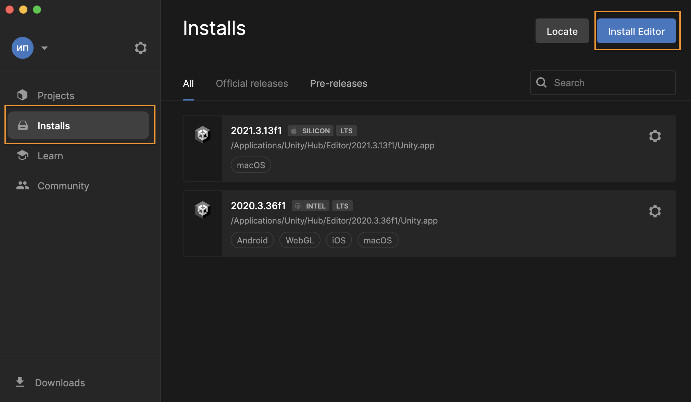
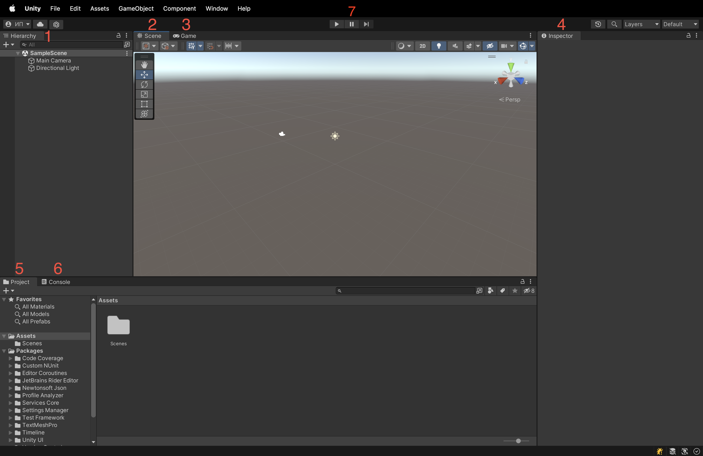
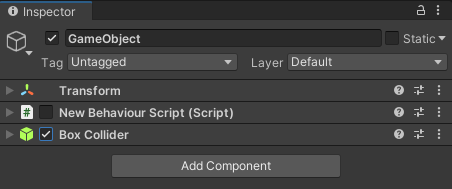
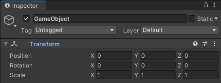

# Meeting Unity

Introduction to basic tools of the Unity game engine.

## Contents

1. [Chapter I](#chapter-i) \
   1.1. [Introduction](#introduction)
2. [Chapter II](#chapter-ii) \
   2.1. [Unity Tools](#unity-tools) \
   2.2. [MonoBehaviour](#monobehaviour) \
   2.3. [UnityEngine libraries](#unityengine-libraries) \
   2.4. [Compilation directives](#compilation-directives) \
   2.5. [References to objects and resources](#references-to-objects-and-resources) \
   2.6. [Where to get free assets](#where-to-get-free-assets)
3. [Chapter III](#chapter-iii) \
   3.1. [Part 1. First game](#part-1-first-game)

## Chapter I

## Introduction

In this project you will learn about the Unity game engine, the principles of working with the Unity editor, its built-in classes and libraries. You will also need to choose a game theme from the suggested list and make its initial draft implementation on the Unity engine.

## Chapter II

### Unity Tools

Unity is one of the most popular engines at the moment. Unity supports all modern platforms, including mobile devices, virtual reality, desktops, consoles, and so on. An important advantage of this engine is that it is a great starting point for game development, thanks to its flexible modular system for creating scenes and characters in the game, as well as its extensive community, which creates ready-made free and paid assets and helps to solve problems during the development process.
1. The first step is to install the Unity editor (Installs -> Install Editor). For now, you will need version 2021.3 LTS.

2. Next, create a project (Projects -> New Project). In the project creation window there will be a list of templates, in which you can, for example, look for the implementation of any mechanics. For this project, it is best to choose the 3D Core template.

3. After creating the project, the editor window opens. The default layout contains all the windows we need, but you can customize it as you like by rearranging and grouping the windows. You can also open and close windows. Each window has its own configuration options as well, accessible by clicking on the three dots in the upper right corner. In addition, most of them have a toolbar with many options.

Main windows:
    1. **Main windows**.Hierarchical text representation of each object in the scene. Hierarchy reveals the structure of how objects are attached to each other
    2. **The Scene View**. Allows you to visually move and edit your scene. The scene view can display a 3D or 2D perspective, depending on the type of project you are working on.
    3. **The Game View**. Is rendered from the Camera(s) in your game. It represents your final, published game.
    4. **The Inspector window**. Allows you to view and edit all the properties of the currently selected object.
    5. **The Project window **. Displays your resource library available for use in your project. When you import resources into your project, they are displayed here.
    6. **Console window**
    7. Buttons for switching between **Play Mode** and **Edit mode**

It is also worth mentioning the **Package Manager window*. It opens via the menu **Window -> Package Manager** and allows you to expand the editor's functionality by installing third-party packages.

Now let's review the basic terms that came up when we looked at the available windows.

**Scene**. Scenes contain objects from your game. They can be used to create a main menu, individual levels and for other purposes. You can think of each scene file as a separate game level. In each scene you can place objects of the environment, fences, scenery, creating the design and the game itself piece by piece.

**Game Object**. GameObject is the most important concept in the Unity editor. Every object in your game is a game object, from characters and collectibles to lights, cameras, and special effects. However, a game object can't do anything by itself; you need to give it properties before it can become a character, an environment, or a special effect. To create an empty game object, choose **RMB GameObject -> Create Empty in the Hierarchy or Scene View window**.

**Components**. Components are the functional parts of each game object. Components contain properties that you can edit to define the behavior of `GameObject`. To view the list of components attached to a game object in the inspector window, select the game object either in the hierarchy window or in the scene view. You can attach many components to a game object. Each game object always contains a `Transform` component, which defines the position, rotation and scale of the game object.

**Prefabs**. The prefab acts as a template. This is a game object saved as an asset in the project window. You can create any number of instances from prefabs, whether they are exactly the same or differ in some way. Finished instances can either be created in the editor and saved as part of your scenes, or created at runtime.

**Build**. Unity allows you to build an application for different platforms and with different settings. Use the **Build Settings**(**File** -> **Build Settings**) window to select the platform and start the build process.
Unity supports two types of builds:
- A release build that includes only what is needed to run the application. This is a type by default.
- Debug build, which includes debug scripts. Debug build includes an additional set of options, such as support for deep profiling and debugging scripts.

Before building you need to add the necessary scenes to the **Scenes In Build** list using the **"Add Open Scene"** button. The order of the scenes in the list is important: inside the application the first scene in the list will be loaded, so in this place we usually put "bootstrap scenes", which will load all the other necessary content.

To start the build process you need to click **Build** or **Build And Run** if you need to immediately launch the built application on the final device after the end of the process.

### MonoBehaviour

**MonoBehaviour** is a base class that contains many methods and properties for working with objects in the scene. Scripts inherited from **MonoBehaviour** can be added as components to **GameObject**.

You can create scripts with the default template by clicking **PCM in the Project window** → **Create** → **C# Script**. You can add the created script to **GameObject** by dragging it to the desired object in the scene or by clicking **Add Component** in the inspector.

All public fields, as well as fields marked with `[SerializeField]` attribute will be displayed in the inspector. You can easily change their values from there without changing the code.

```csharp
public class NewBehaviourScript : MonoBehaviour
{
    public float Speed; // It is not recommended to use public fields

    [SerializeField]
    private int health; // A more preferable option
}
```


Not only simple types can be serialized, but also entire classes by marking them with the `[Serializable]` attribute:

```csharp
using System;

[Serializable]
public class Characteristics
{
    [SerializeField]
    private float speed;

    [SerializeField]
    private int health;
}

public class NewBehaviourScript : MonoBehaviour
{
    [SerializeField]
    private Characteristics characteristics;
}
```


**Note:** values set in **Play Mode** (when the game is running) are not saved after stopping the game, but return to their original state.

Also, **MonoBehaviour** inheritors may contain methods that are called by the engine at certain moments of the object's life cycle:

```csharp
public class NewBehaviourScript : MonoBehaviour
{
    // Called once at the beginning of the object's life
    void Start()
    {
    }

    // Called every frame throughout the life of the object
    void Update()
    {
    }
}
```

There are also methods such as:

-   **Awake*. It is called once during object initialization, before calling Start;
-   **OnDestroy**.It is called when the object is destroyed;
-   **FixedUpdate**. It is called a fixed number of times per second and, unlike Update, does not depend on fps (used mainly for physical calculations);
-   **OnEnable**, **OnDisable**. They are called respectively when the object is turned on or off (via the **SetActive** method or a checkbox in the inspector).

**The image below shows the complete sequence of calling life cycle methods:**


**Inherited properties**

All scripts inherited from **MonoBehaviour** contain properties defined in the base class. The most commonly used ones are:  

-   **enabled** is a property of **bool** type, which is responsible for component's state (enabled/disabled). You can change this property either from the code or with the help of corresponding checkboxes in the inspector. Any **GameObject** components are inheritors of **MonoBehaviour**;

```csharp
// GetComponent - getting a component by its type. See below.
GetComponent<NewBehaviourScript>().enabled = false;
GetComponent<BoxCollider>().enabled = true;
```



-   **transform** is a reference to the component containing the object's position, rotation and scale. Transform is added by default to all **GameObject**;



-   **gameObject** is a reference to the **GameObject** to which the component belongs;
    -   **gameObject.SetActive** is a method that allows you to turn on/off **GameObject** (a checkbox in the inspector, to the left of the object name)
    -   **gameObject.activeSelf** is a property that shows the current state of the object - enabled/disabled.

**Inherited methods**

-   **GetComponent<>** returns a component of the specified type or null, if **GameObject** does not contain such a component. This method is relatively time-consuming, so it is not recommended to use it in **Update** and **FixedUpdate** methods. Instead, you should pre-cache the component in **Start** or **Awake**:

```csharp
public class NewBehaviourScript : MonoBehaviour
{
    private Rigidbody _rigidbody;

    private void Start()
    {
        _rigidbody = GetComponent<Rigidbody>();
    }

    private void Update()
    {
        // Rigidbody is cached in Start
        Vector3 position = _rigidbody.position;
        // Position output to console
        Debug.Log(position);
    }
}
```

The fastest way to get component references is to use serialized fields. In this case, the required component is dragged through the inspector, and the engine will not waste time searching for the required object or objects during scene initialization or runtime.

```csharp
public class NewBehaviourScript : MonoBehaviour
{
    [SerializeField]
    private Rigidbody rigidbody;

    // ...
}
```

There are other methods of component search: **GetComponents**, **GetComponentInChildren**, **GetComponentsInChildren**, etc.

**Static methods**

-   **Instantiate** is a method that creates an object in the scene from a prefab.

```csharp
// Prefab is dragged from the inspector
[SerializeField]
private GameObject prefab;

private void Start()
{
    Vector3 spawnPosition = Vector3.one; // Position (1; 1; 1)
    Quaternion rotation = Quaternion.identity; // Zero rotation

    // Creating an object with a start position and rotation
    GameObject newObject = Instantiate(prefab, spawnPosition, rotation);
}
```

If you need to get a component immediately after creating an object, there is a better way:

```csharp
// Prefab is still dragged from the inspector.
// This method ensures that the prefab will have a NewBehaviourScript component
[SerializeField]
private NewBehaviourScript prefab;

private void Start()
{
    // Creating an object + getting the right component.
    // Position and rotation by default
    NewBehaviourScript componentOfNewObject = Instantiate(prefab);
}
```

-   **Destroy** is a method that destroys **GameObject** or its component.

```csharp
Rigidbody rigidbody = gameObject.GetComponent<Rigidbody>();

// Removes Rigidbody component from the object
Destroy(rigidbody);

// Deletes the object itself from the scene
Destroy(gameObject);
```

### UnityEngine libraries

Unity contains many built-in libraries that solve major problems in game development.

**Vector**

Vectors are used mainly to specify position, rotation and scale of objects. There are two variations of vectors - **Vector2** and **Vector3**, containing two and three components of **float** type, respectively.

```csharp
// Saving a position to a variable
Vector3 position = transform.position;

// Moving an object to a point (1; 2; 3)
transform.position = new Vector3(1f, 2f, 3f);

// Moving an object to a point (0; 0; 0)
transform.position = Vector3.zero;

// Moving an object by 5 along the X-axis
transform.Translate(new Vector3(5f, 0f, 0f));
```

**Mathf**

A collection of general mathematical functions.

```csharp
// Converting degrees to radiations
float radians = degrees * Mathf.Deg2Rad;

// Converting radians to degrees
float degrees = radians * Mathf.Rad2Deg;

Mathf.Abs(-5); // 5
Mathf.Sin(Mathf.PI); // sin(pi)
Mathf.Cos(Mathf.PI); // cos(pi)
Mathf.Floor(5.6f); // 5
Mathf.Round(5.5f); // 6
Mathf.Ceil(5.2f); // 6
Mathf.Clamp(value, 0f, 1f); // Limit [0; 1]
...
```

**Random**

A class for generating random numbers. Notice that C# also contains its own class `System.Random`, so it is recommended to add the namespace `UnityEngine.Random` to the class name.

```csharp
// A random number in the interval [0; 1]
float randomFloat = UnityEngine.Random.Range(0f, 1f);

// A random number in the interval [0; 9]. The number 10 is not in the interval!
int randomInt = UnityEngine.Random.Range(0, 10);
```

These classes are some of the most commonly used when creating games. You can find documentation for all existing **UnityEngine** classes in the Unity documentation.

### Compilation directives

Directives allow you to include or exclude certain parts of the code from the build at the compile stage.

```csharp
#if UNITY_EDITOR
    Debug.Log("Running in editor")
#else
    Debug.Log("Running in build")
#endif
```

Unity has a large number of directives defined for different purposes. You can also define your own directives in **File** → **Build Settings** → **Player Settings** → **Player** → **Scripting Define Symbols**.

### References to objects and resources

As mentioned earlier, you can get a reference to an object from the scene by creating a serialized field and dragging the desired object there through the inspector:

```csharp
public class NewBehaviourScript : MonoBehaviour
{
    [SerializeField]
    private GameObject obj;

    // ...
}
```

If you don't need the **GameObject** itself, but its component, you can create a reference to the required component and drag the object through the inspector in the same way.

```csharp
public class NewBehaviourScript : MonoBehaviour
{
    // The object must contain a component of the specified type,
    // otherwise you can't drag it through the inspector
    [SerializeField]
    private Rigidbody objectRigidbody;

    private void Update()
    {
        Debug.Log(objectRigidbody.velocity);
    }
}
```

Similarly with resources and prefabs, which are in the project folder:

```csharp
public class NewBehaviourScript : MonoBehaviour
{
    [SerializeField]
    private AudioClip clip;

    private void Start()
    {
        Debug.Log(clip.name);
    }
}
```

**Where to store prefabs and other resources?**

Resources can be located in any folder within the project. They can be moved at any time through the unity editor (to move the files correctly outside the unity editor, you must also move the appropriate .meta files).

**Note**: you can create a folder **Resources** and store all the resources in it, which will allow you to load them directly from the code by file name using `Resources.Load`. The disadvantage of this approach is that by default only those assets that are used in the scenes specified in **Build Settings** end up in the final game build, but all the files that are in the folder(s) named **Resources** end up in the build, even if they are not used in the project, which can make the build grow larger. To avoid this, you can store the resources elsewhere instead of creating a folder(s) named **Resources**. For example: **Sprites**, **Audio**, **Models** etc.

### Where to get free assets?

Unity has its own [Asset Store](https://assetstore.unity.com/). If you want to add an asset to the project, you need to go to the asset page in **Asset Store**, click **Add To My Assets**, and in the pop-up window select **Open in Unity**. After that **Package Manager** will open in the unity window, where you should click on **Import**. As a result, the asset will be imported into your project.

Assets loaded from **Package Manager** are often imported to the root of the project - the **Assets** folder. For convenience, you can create a separate folder (for example, **Imported**) and move all the assets to it after importing.

To reduce the total weight of your project and also to avoid long loading when switching between **git** branches, you can import only the assets you need, not the entire package.

[Mixamo](https://www.mixamo.com/) is also worth mentioning. There you can find a large number of free 3d character models and animations. Animations from **Mixamo** are suitable not only for models from this site, but also for any other humanoid models.

Besides, you can also find a small ready-made set of models for the projects of this branch [here].(https://disk.yandex.ru/d/X5GpXMIHQlcylQ).


## Chapter III

You will have to implement one of the proposed projects on the Unity engine in accordance with the Technical Specification.

## Part 1. First game

### General project requirements

- The selected project must be implemented on the **Unity** engine of the latest version **2021.3 LTS**.
- The code must be formatted according to the **Microsoft** style
- You need to prepare two builds of the game: one for desktop OS (PC - Windows/Linux/Mac), the other one for mobile OS (Android/IOS)
- Use the TextMeshPro library for text in the UI
- Use SerializedField for configurable parameters
- Each game must contain at least two scenes: the main menu scene and the game scene

### Project No.1

A game about gathering your crowd like **agar.io**, **Archers.io** and **Crowd City:**

- The game scene must be a map with obstacles (stones, buildings, etc.) bounded at the edges.
- The player appears on the map in the predetermined spawn locations. There should be at least 3 different spawn locations with the ability to configure them (position, spawn radius)
- The player can freely move around the map. For PC control, the player can use both arrow keys and WASD. The mobile version requires a "floating" joystick, which is not available for the PC version.
- The player runs around the map, on which stickmans appear with configurable intervals. For their appearance it is necessary to reuse the already prepared mechanics of spawning
- When you run up close to the stickmans (also configurable), you join them to your "crowd".
- The whole crowd moves with the main player "around" him
- At the spawn points on the map with some periodicity immobile enemies appear. When the crowd approaches the enemy at some distance, the crowd starts shooting at the enemy. All parameters should be configurable
- Each member of the crowd has a gun that fires bullets in the direction of the enemy at set intervals. You can use regular spheres (basic Unity primitives) as bullets
- Health points of enemies, player, stickmans; weapon damage; bullet speed must also be configurable
- The game must be time-limited. The duration of the game must be configurable
- During the game the UI must display the current size of the player's crowd and the remaining game time. 15 seconds before the end, the timer text must turn red, signaling the upcoming end of the game
- The UI panel with the number of points scored by the player = the number of joined stickmans should be displayed at the end of the game time
- There must be a button in the main menu scene to start the game and a table of top-3 records for the number of points scored with the time the record was set. Records must be saved between logins to the game.

### Project No.2

Endless runner game like **Subway Surfers**, **Temple Run**, **Crash Bandicoot: On the Run!**

- The game scene must be a plane, conventionally divided into three lines
- The player runs along these lines, moving between them using the left-right arrow keys or the A-D keys on PC, or the left-right swipe on mobile devices
- The player can jump and roll with the up/down arrow keys or the W-S keys on PC, or with the up/down swipe on mobile devices
- Three types of obstacles must be implemented:
    1. those that can be jumped over; 
    2. those that can be passed by rolling under; 
    3. those that can only be bypassed by other lines (analogous to the trains in Subway Surfers)
- Over time, the speed of the game is gradually increased until it reaches the maximum value, which must be configurable. The speed of increase should also be configurable
- Bonuses must periodically appear on the path, giving invulnerability for a configurable period of time. When hitting an obstacle, the bonus expires, and the obstacle "destroys" itself (you can limit yourself to its simple disappearance).
- The game lasts until the player hits an obstacle. After the crash the distance run is displayed on the final panel in the UI
- During the game, the UI should display the current distance run
- There must be a button in the main menu scene to start the game and a table of top-3 records for the number of points scored with the time the record was set. Records must be saved between logins to the game.

### Project No.3

A game about making and selling juices like **My Mini Mart:**

- The game scene must be a limited area with zones where future trees and plants will be placed, factory machines will be built, and cash registers will be located.
- The player can freely move around the map. For PC control, the player can use both arrow keys and WASD. The mobile version requires a "floating" joystick, which is not available for the PC version.
- The player has a wallet with all his money, which he gets from selling juice and spends to buy new trees and plants, cars and other environments. This amount of money is displayed in the UI during the game.
- Initially, the player starts the game with a fixed, configurable amount of money. It can be immediately in his wallet or nearby on the map, where it needs to be collected.
- At the beginning, the player can buy and plant an orange tree, a basic juicer, and a cash register. The purchase itself is a short stay of the player in the zone, during which money is gradually written off from the wallet (similar to **My Mini Mart**). The time in which the purchase takes place must be configurable and depend on the amount of purchase (buying a car for 100 coins should last a little longer than buying a car for 10 coins). The cost of trees, plants and machines should also be configurable and displayed in the in-game UI.
- Trees and plants produce a certain amount of fruit in a certain amount of time. Machines similarly run a configurable amount of time (i.e., juice is not produced immediately after adding oranges to the juicer). Everything should be configurable and displayed in the in-game UI.
- Machines (including the juicer) have two "sub-zones". In one you can only stack resources (fruit), from the other take already processed resources (juice, for example)
- Only one fruit can be juiced at a time, but it must be possible to put several fruits in a "tray" in front of the juicer, from where they will be dragged into the juicer. A similar "tray" must be at the outlet of the juicer, where the jars of juice will be placed.
- To collect any resources it is enough to stay in the resource gathering zone for some time. To give resources (to the juicer, for example) it is also enough to stand for a while with resources in hand near the resource giving zone.
- The player can carry several resources of different types in his hands at once, but only the desired resources can be given away. For example, a juicer cannot be given juice again, even if it is in the player's hand. The resources themselves in the player's hand are placed on top of each other (like in a stack).
- To sell juice, the player simply walks up to the cash register, similar to a juicer. The sale can be *momentary*.
- It is also necessary to add the ability to "upgrade" the juicer and the orange tree. The orange tree after upgrading increases the maximum possible number of oranges grown at one time. The juicer starts to work faster after the upgrade.
- The ability to upgrade must open after the player reaches the limit of a certain amount of money. The upgrade itself is similar to buying trees or cars (similar to **My Mini Mart**).
- The main menu scene must have a button to start the game and the current amount of money the player has. The amount of money the player has, as well as his progress (constructions, current resources on trees/machines) should be saved between logins to the game.

💡 [Tap here](https://forms.yandex.ru/cloud/64707086c417f3170b8290fd/), **to leave your feedback on the project**. Product Team really tries to make your educational experience better..
