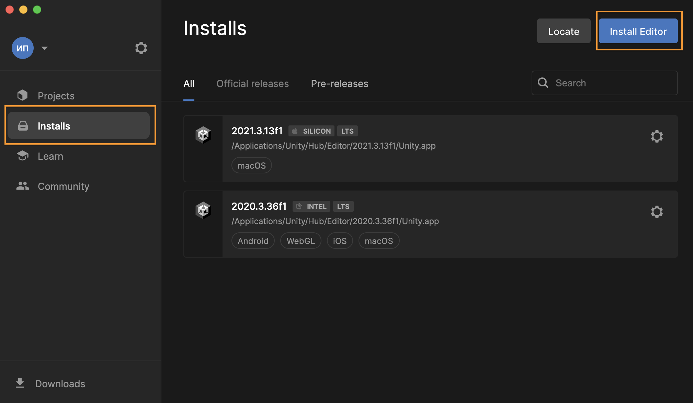
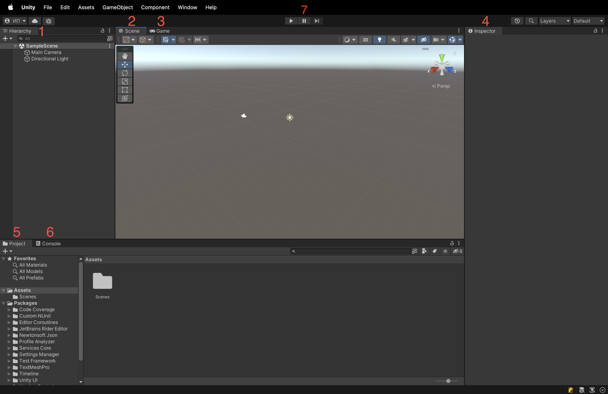
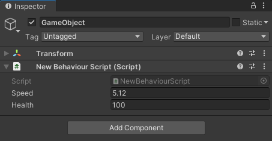
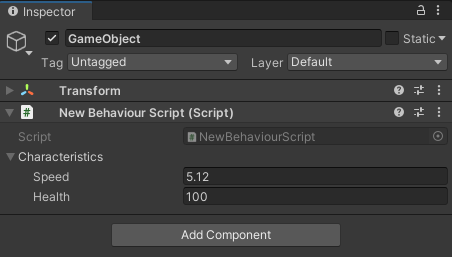
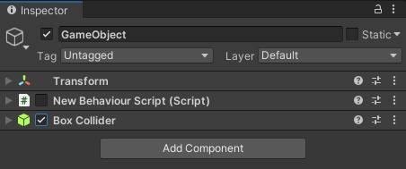
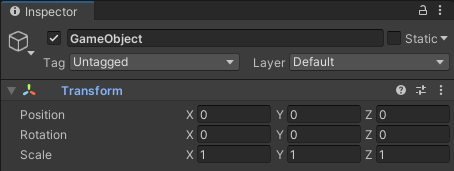

# Meeting Unity

Ознакомление с базововым инструментарием игрового движка Unity.

## Contents

1. [Chapter I](#chapter-i) \
   1.1. [Introduction](#introduction)
2. [Chapter II](#chapter-ii) \
   2.1. [Инструменты юнити](#инструменты-unity) \
   2.2. [MonoBehaviour](#monobehaviour) \
   2.3. [Библиотеки UnityEngine](#библиотеки-unityengine) \
   2.4. [Директивы компиляции](#директивы-компиляции) \
   2.5. [Ссылки на объекты и ресурсы](#ссылки-на-объекты-и-ресурсы) \
   2.6. [Где брать бесплатные ассеты?](#где-брать-бесплатные-ассеты)
3. [Chapter III](#chapter-iii) \
   3.1. [Part 1. Первая игра](#part-1-первая-игра)

## Chapter I

## Introduction

В данном проекте тебе предстоит познакомиться с игровым движком Unity, изучить принципы работы с редактором Unity, со встроенными в него классами и библиотеками. Также тебе будет необходимо выбрать из предложенного перечня тему игры и сделать её первоначальную черновую реализацию на движке Unity.

## Chapter II

### Инструменты Unity

Unity - один из самых популярных движков на данный момент. Unity поддерживает все современные платформы, включая мобильные устройства, виртуальную реальность, настольные компьютеры, консоли и так далее. Важным плюсом движка является то, что он отлично подходит для старта в игровой разработке благодаря использованию гибкой модульной системы при создании сцен и персонажей в игре, а также обширному комьюнити, которое создаёт готовые платные и бесплатные ассеты и помогает в решении возникших проблем в процессе разработки.
1. Первым шагом необходимо установить редактор Unity (вкладка Installs -> Install Editor). На текущий момент тебе понадобится версия 2021.3 LTS.

2. Далее необходимо создать проект (вкладка Projects -> New Project). В окне создания проекта будет представлен перечень шаблонов, в которых можно, например, подсмотреть реализацию каких-либо механик. Для данного проекта лучше всего выбирать шаблон 3D Core.

3. После создания проекта откроется окно редактора. Макет по умолчанию содержит все окна, которые нам нужны, но ты можешь настроить его по своему усмотрению, изменив порядок и сгруппировав окна. Ты также можешь открывать и закрывать окна. Каждое окно также имеет свои собственные параметры конфигурации, доступные по нажатии на три точки в правом верхнем углу. Кроме того, у большинства из них также есть панель инструментов с большим количеством опций.

Основные окна:
    1. **Окно иерархии игровых объектов сцены (Hierarchy)**. Представляет собой иерархическое текстовое представление каждого объекта в сцене. Иерархия раскрывает структуру того, как объекты прикреплены друг к другу
    2. **Окно просмотра сцены (Scene View)**. Позволяет тебе визуально перемещаться и редактировать твою сцену. Вид сцены может отображать 3D или 2D перспективу, в зависимости от типа проекта, над которым ты работаешь.
    3. **Окно просмотра в игровом режиме (Game View)**. Отрисовывается из камеры (камер) в твоей игре. Это отображение финальной, опубликованной игры.
    4. **Окно инспектора (Inspector)**. Позволяет просматривать и редактировать все свойства выбранного в данный момент объекта.
    5. **Окно файловой системы (Project)**. Отображает твою библиотеку ресурсов, доступных для использования в твоем проекте. Когда ты импортируешь ресурсы в свой проект, они отображаются здесь.
    6. **Окно консоли (Console)**
    7. Кнопки перехода между **Play Mode** и **Edit mode**

Также стоит упомянуть про **Окно менеджера пакетов (Package Manager)**. Оно открывается через меню **Window -> Package Manager** и позволяет расширять функционал редактора с помощью установки сторонних пакетов.

Теперь разберём основные понятия, которые возникли при рассмотрении доступных окон.

**Сцена (Scene)**. Сцены содержат объекты твоей игры. Они могут использоваться для создания главного меню, отдельных уровней и для других целей. Можно считать каждый файл сцены отдельным игровым уровнем. В каждой сцене можно разместить объекты окружения, ограждения, декорации, по кусочкам создавая дизайн и саму игру.

**Игровой объект (Game Object)**. GameObject - это самая важная концепция в редакторе Unity. Каждый объект в твоей игре - это игровой объект, от персонажей и предметов коллекционирования до света, камер
и спецэффектов. Однако игровой объект ничего не может сделать сам по себе; тебе нужно придать ему свойства, прежде чем он сможет стать персонажем, окружением или специальным эффектом. Чтобы создать пустой игровой объект, выбери **ПКМ GameObject -> Create Empty в окне иерархии или просмотра сцены**.

**Компоненты (Components)**. Компоненты - это функциональные части каждого игрового объекта. Компоненты содержат свойства, которые ты можешь редактировать, чтобы определить поведение `GameObject`. Чтобы просмотреть список компонентов, прикрепленных к игровому объекту в окне инспектора, выбери игровой объект либо в окне иерархии, либо в
представлении сцены. Ты можешь присоединить множество компонентов к игровому объекту. Каждый игровой объект всегда содержит единственный компонент `Transform`, который определяет местоположение, поворот и масштаб игрового объекта.

**Префабы (Prefabs)**. Префабы действуют как шаблоны. Представляют из себя игровой объект, сохранённый как ассет в окне проекта. Из префабов ты можешь создать любое количество экземпляров, как совершенно одинаковых, так и отличающихся какими-либо свойствами. Готовые экземпляры могут быть либо созданы в редакторе и сохранены как часть твоих сцен, либо созданы во время выполнения.

**Сборка приложения**. Unity позволяет собрать приложение для различных платформ и с разными настройками. Чтобы выбрать платформу и начать процесс сборки, используй окно **Build Settings** (**File** -> **Build Settings**).
Unity поддерживает два типа сборок:
- Сборка релиза, которая включает в себя только то, что необходимо для запуска приложения. Это тип сборки по умолчанию.
- Debug сборка, которая включает в себя отладочные скрипты. Debug сборка включает дополнительный набор настроек, таких как поддержка глубокого профилирования и отладка сценариев.

Перед сборкой необходимо добавить необходимые сцены в список **Scenes In Build** с помощью кнопки **«Add Open Scene»**. Порядок сцен в списке имеет значение: приложения будет загружена первая в списке сцена, поэтому на это место обычно ставят «загрузочные сцены», которые подгрузят весь остальной необходимый контент.

Для начала процесса сборки необходимо нажать **Build** или **Build And Run**, если есть необходимость сразу же запустить собранное приложение на конечном устройстве по завершению процесса.

### MonoBehaviour

**MonoBehaviour** - это базовый класс, который содержит множество методов и свойств для работы с объектами на сцене. Скрипты, унаследованные от **MonoBehaviour**, можно добавлять в качестве компонентов на **GameObject**.

Создавать скрипты с шаблоном по умолчанию можно, нажав **ПКМ в окне Project** → **Create** → **C# Script**. Ты можешь добавить созданный скрипт на **GameObject**, перетащив его на нужный объект на сцене или нажав **Add Component** в инспекторе.

Все публичные поля, а также поля, помеченные атрибутом `[SerializeField]`, будут отображаться в инспекторе. Оттуда их значения можно удобно менять, не изменяя код.

```csharp
public class NewBehaviourScript : MonoBehaviour
{
    public float Speed; // Не рекомендуется использовать публичные поля

    [SerializeField]
    private int health; // Более предпочтительный вариант
}
```



Сериализовать можно не только простые типы, но и целые классы, предварительно пометив их атрибутом `[Serializable]`:

```csharp
using System;

[Serializable]
public class Characteristics
{
    [SerializeField]
    private float speed;

    [SerializeField]
    private int health;
}

public class NewBehaviourScript : MonoBehaviour
{
    [SerializeField]
    private Characteristics characteristics;
}
```



**Примечание:** значения, заданные в **Play Mode** (в режиме запущенной игры), не сохраняются после остановки игры, а возвращаются в исходное состояние.

Также наследники **MonoBehaviour** могут содержать методы, которые вызываются движком в определенные моменты жизненного цикла объекта:

```csharp
public class NewBehaviourScript : MonoBehaviour
{
    // Вызывается один раз в начале жизни объекта
    void Start()
    {
    }

    // Вызывается каждый кадр на протяжении всей жизни объекта
    void Update()
    {
    }
}
```

Кроме этих методов часто используются:

-   **Awake** - вызывается один раз при инициализации объекта, до вызова Start;
-   **OnDestroy** - вызывается при уничтожении объекта;
-   **FixedUpdate** - вызывается фиксированное количество раз в секунду и, в отличие от Update, не зависит от fps (используется преимущественно для физических расчетов);
-   **OnEnable**, **OnDisable** - вызываются соответственно при включении и выключении объекта (через метод **SetActive** или галочку в инспекторе).

**На изображении ниже показана полная последовательность вызова методов жизненного цикла:**


**Унаследованные свойства**

Все скрипты, унаследованные от **MonoBehaviour**, содержат свойства, определенные в базовом классе. Наиболее часто используемыми являются:

-   **enabled** - свойство типа **bool**, отвечающее за состояние компонента (включен/выключен). Это свойство можно менять как из кода, так и с помощью соответствующих галочек в инспекторе. Любые компоненты **GameObject** являются наследниками **MonoBehaviour**;

```csharp
// GetComponent - получение компонента по его типу. См. ниже.
GetComponent<NewBehaviourScript>().enabled = false;
GetComponent<BoxCollider>().enabled = true;
```



-   **transform** - ссылка на компонент, содержащий позицию, поворот и масштаб объекта. Transform добавляется по умолчанию на все **GameObject**;



-   **gameObject** - ссылка на **GameObject**, которому принадлежит данный компонент;
    -   **gameObject.SetActive** - метод, позволяющий включать/выключать **GameObject** (галочка в инспекторе, слева от названия объекта)
    -   **gameObject.activeSelf** - свойство, показывающее текущее состояние объекта - включен/выключен.

**Унаследованные методы**

-   **GetComponent<>** - возвращает компонент указанного типа или null, если **GameObject** не содержит такого компонента. Данный метод является относительно затратным по времени, поэтому его не рекомендуется использовать в методах **Update** и **FixedUpdate**. Вместо этого следует предварительно кэшировать компонент в **Start** или **Awake**:

```csharp
public class NewBehaviourScript : MonoBehaviour
{
    private Rigidbody _rigidbody;

    private void Start()
    {
        _rigidbody = GetComponent<Rigidbody>();
    }

    private void Update()
    {
        // Rigidbody закэширован в Start
        Vector3 position = _rigidbody.position;
        // Вывод позиции в консоль
        Debug.Log(position);
    }
}
```

Наиболее быстрый вариант получения ссылок на компоненты - это использование сериализованных полей. В этом случае нужный компонент перетаскивается через инспектор, и движок при инициализации сцены или в рантайме не будет тратить время на поиск нужного объекта или объектов.

```csharp
public class NewBehaviourScript : MonoBehaviour
{
    [SerializeField]
    private Rigidbody rigidbody;

    // ...
}
```

Существуют и другие методы поиска компонентов: **GetComponents**, **GetComponentInChildren**, **GetComponentsInChildren** и т. п.

**Статические методы**

-   **Instantiate** - метод, создающий объект на сцене из префаба.

```csharp
// Префаб перетаскивается из инспектора
[SerializeField]
private GameObject prefab;

private void Start()
{
    Vector3 spawnPosition = Vector3.one; // Позиция (1; 1; 1)
    Quaternion rotation = Quaternion.identity; // Нулевое вращение

    // Создание объекта с указанием начальной позиции и вращения
    GameObject newObject = Instantiate(prefab, spawnPosition, rotation);
}
```

Если после создания объекта тебе нужно сразу же получить какой-либо компонент, то лучше воспользоваться другим способом:

```csharp
// Префаб все также перетаскивается из инспектора.
// Этот способ гарантирует, что префаб будет иметь компонент NewBehaviourScript
[SerializeField]
private NewBehaviourScript prefab;

private void Start()
{
    // Создание объекта + получение нужного компонента.
    // Позиция и вращение по умолчанию
    NewBehaviourScript componentOfNewObject = Instantiate(prefab);
}
```

-   **Destroy** - метод, уничтожающий **GameObject** или его компонент.

```csharp
Rigidbody rigidbody = gameObject.GetComponent<Rigidbody>();

// Удаляет с объекта компонент Rigidbody
Destroy(rigidbody);

// Удаляет сам объект со сцены
Destroy(gameObject);
```

### Библиотеки UnityEngine

Unity содержит множество встроенных библиотек, которые решают основные проблемы, возникающие при разработке игр.

**Vector**

Векторы используются в основном для задания позиции, поворота и масштаба объектов. Существуют две вариации векторов - **Vector2** и **Vector3**, содержащие две и три компоненты типа **float** соответственно.

```csharp
// Сохранение позиции в переменную
Vector3 position = transform.position;

// Перемещение объекта в точку (1; 2; 3)
transform.position = new Vector3(1f, 2f, 3f);

// Перемещение объекта в точку (0; 0; 0)
transform.position = Vector3.zero;

// Перемещение объекта на 5 единиц по оси X
transform.Translate(new Vector3(5f, 0f, 0f));
```

**Mathf**

Коллекция общих математических функций.

```csharp
// Преобразованиe градусов в радианы
float radians = degrees * Mathf.Deg2Rad;

// Преобразованиe радиан в градусы
float degrees = radians * Mathf.Rad2Deg;

Mathf.Abs(-5); // 5
Mathf.Sin(Mathf.PI); // sin(pi)
Mathf.Cos(Mathf.PI); // cos(pi)
Mathf.Floor(5.6f); // 5
Mathf.Round(5.5f); // 6
Mathf.Ceil(5.2f); // 6
Mathf.Clamp(value, 0f, 1f); // ограничить [0; 1]
...
```

**Random**

Класс для генерации случайных чисел. Обрати внимание, что C# также содержит собственный класс `System.Random`, поэтому рекомендуется к названию класса добавлять пространство имен - `UnityEngine.Random`.

```csharp
// Случайное число в промежутке [0; 1]
float randomFloat = UnityEngine.Random.Range(0f, 1f);

// Случайое число в промежутке [0; 9]. Число 10 в промежуток не входит!
int randomInt = UnityEngine.Random.Range(0, 10);
```

Представленные классы являются одними из наиболее часло используемых при создании игр. В документации Unity ты можешь найти документацию для всех существующих классов **UnityEngine**.

### Директивы компиляции

Директивы позволяют на стадии компиляции включать в сборку или исключать из сборки определенные части кода.

```csharp
#if UNITY_EDITOR
    Debug.Log("Running in editor")
#else
    Debug.Log("Running in build")
#endif
```

В юнити определено большое количество директив для разных целей. Также можно определять собственные директивы в **File** → **Build Settings** → **Player Settings** → **Player** → **Scripting Define Symbols**.

### Ссылки на объекты и ресурсы

Как уже отмечалось ранее, получить ссылку на объект со сцены можно, создав сериализованное поле и перетащив туда нужный объект через инспектор:

```csharp
public class NewBehaviourScript : MonoBehaviour
{
    [SerializeField]
    private GameObject obj;

    // ...
}
```

Если тебе требуется не сам **GameObject**, а его компонент, можно создать ссылку на нужный компонент и так же перетащить объект через инспектор.

```csharp
public class NewBehaviourScript : MonoBehaviour
{
    // Объект должен содержать компонент указанного типа,
    // иначе не получится перетащить его через инспектор
    [SerializeField]
    private Rigidbody objectRigidbody;

    private void Update()
    {
        Debug.Log(objectRigidbody.velocity);
    }
}
```

Аналогично с ресурсами и префабами, которые находятся в папке проекта:

```csharp
public class NewBehaviourScript : MonoBehaviour
{
    [SerializeField]
    private AudioClip clip;

    private void Start()
    {
        Debug.Log(clip.name);
    }
}
```

**Где хранить префабы и другие ресурсы?**

Ресурсы могут находиться в любых папках внутри проекта. Их можно в любой момент переместить через редактор юнити (для корректного перемещения файлов вне редактора юнити, нужно также перемещать соответствующие .meta файлы).

**Примечание**: можно создать папку **Resources** и хранить в ней все ресурсы, что позволит загружать их непосредственно из кода по имени файла с помощью `Resources.Load`. Недостаток такого подхода заключается в следующем: по умолчанию в итоговую сборку игры попадают только те ассеты, которые используются в сценах, указанных в **Build Settings**, однако все файлы, находящиеся в папке (папках) с названием **Resources**, попадают в сборку, даже если они не используются в проекте, из-за чего сборка может достигать больших размеров. Чтобы этого избежать, можно не создавать папку (папки) с названием **Resources**, а хранить ресурсы в другом месте. Например: **Sprites**, **Audio**, **Models** и т. д.

### Где брать бесплатные ассеты?

У юнити есть собственный магазин ассетов - [Unity Asset Store](https://assetstore.unity.com/). Чтобы добавить ассет в проект, необходимо зайти на страницу ассета в **Asset Store**, нажать **Add To My Assets**, и во всплывающем окне выбрать **Open in Unity**. После этого в окне юнити откроется **Package Manager**, в котором нужно нажать **Import**. В результате ассет импортируется в твой проект.

Очень часто ассеты, загруженные из **Package Manager**, импортируются в корень проекта - в папку **Assets**. Для удобства можно создать отдельную папку (например, **Imported**) и перемещать в нее все ассеты после импорта.

Чтобы уменьшить общий вес проекта, а также избежать долгой загрузки при переходе между ветками **git**, ты можешь импортировать не весь пакет, а только нужные тебе ассеты.

Также стоит упомянуть ресурс [Mixamo](https://www.mixamo.com/). На нем можно найти большое количество бесплатных 3d моделей персонажей и анимаций. Анимации с **Mixamo** подходят не только для моделей с этого сайта, но и для любых других гуманоидных моделей.

Помимо этого ты также можешь найти небольшой готовый набор моделей для проектов данной ветки [здесь](https://disk.yandex.ru/d/X5GpXMIHQlcylQ).


## Chapter III

Тебе предстоит реализовать один из предложенных проектов на движке Unity в соответствии с техническим заданием.

## Part 1. Первая игра

### Общие требования к проектам

- Выбранный проект должен быть реализован на движке **Unity** последней версии **2021.3 LTS**
- Код должен быть отформатирован в соответствии со стилем **Microsoft**
- Необходимо подготовить две сборки игры: одну для настольных ОС (ПК - Windows/Linux/Mac), другую для мобильных ОС (Android/IOS)
- Для текста на UI использовать библиотеку TextMeshPro
- Для настраиваемых параметров использовать SerializedField
- Каждая игра должна содержать минимум две сцены: сцену главного меню и сцену с игрой

### Проект №1

Игра про сбор своей толпы в стиле **agar.io**, **Archers.io** и **Crowd City:**

- Сцена игры должна представлять из себя ограниченную по краям карту с препятствиями (камни, здания и т.д.)
- Игрок появляется на карте в указанных заранее местах спавна. Должно быть по крайней мере 3 разных места спавна игрока с возможность их гибкой настройки (позиция, радиус спавна)
- Игрок может свободно перемещаться по карте. Для управления на ПК игрок может использовать как стрелочки, так и WASD. Для управления в мобильной версии необходимо добавить «плавающий» джойстик, который недоступен для ПК версии
- Игрок бегает по карте, на которой с некоторой настраиваемой периодичностью появляются человечки. Для появления человечков необходимо переиспользовать уже подготовленную механику спавна
- Подбегая к человечкам на некоторое близкое расстояние (также настраиваемое), ты присоединяешь их к своей «толпе»
- Вся толпа перемещается вместе с основным игроком «вокруг» него
- В точках спавна на карте с некоторой периодичностью появляются неподвижные враги. При приближении толпы к врагу на некоторое расстояние толпа начинает стрелять во врага. Все параметры должны быть настраиваемыми
- У каждого члена толпы есть пистолет, который с заданной периодичностью выпускает пули в направлении врага. В качестве пуль можно использовать обычные сферы (базовые примитивы Unity)
- Очки здоровья врагов, игрока, человечков; урон оружия; скорость полета пуль также должны быть настраиваемыми
- Игра должна быть ограничена по времени таймером. Длительность игры должна быть настраиваемой
- Во время игры на UI необходимо выводить текущий размер толпы игрока и оставшееся время игры. За 15 секунд до конца текст таймера должен окраситься в красный сигнализируя о приближающемся окончании игры
- По окончанию игрового времени должна вывестись UI панель с отображением набранного игроком количества очков = количеству присоединенных человечков
- На сцене главного меню должна быть кнопка запуска игры и таблица рекордов топ-3 по количеству набранных очков со временем установки рекорда. Рекорды должны сохраняться между входами в игру.

### Проект №2

Игра в жанре endless runner в стиле **Subway Surfers**, **Temple Run**, **Crash Bandicoot: On the Run!:**

- Сцена игры должна представлять из себя плоскость, условно разделенную вдоль на три линии
- Игрок бежит вдоль этих линий, перемещаясь между ними с помощью стрелочек влево-вправо или клавиш A-D на ПК, или свайпа влево-вправо на мобильных устройствах
- Игрок может делать прыжок и перекат с помощью стрелочек вверх/вниз или клавиш W-S на ПК, или свайпа вверх-вниз на мобильных устройствах
- Требуется реализовать три вида препятствий:
    1. те, которые можно перепрыгнуть; 
    2. те, которые можно преодолеть перекатом; 
    3. те, которые можно только обежать через другие линии (аналог поездов в Subway Surfers)
- С течением времени скорость игры постепенно увеличивается, пока не достигнет максимального значения, которое должно быть настраиваемым. Скорость увеличения также должна быть настраиваемой
- На пути должны периодически появляться бонусы, дающие неуязвимость на некоторое настраиваемое время. При столкновении с препятствием действие бонуса заканчивается, а само препятствие «разрушается» (можно ограничиться простым его исчезновением)
- Игра длится до тех пор, пока игрок не столкнется с препятствием. После столкновения пройденное расстояние выводится на финальной панели в UI
- Во время игры на UI необходимо выводить текущее пройденное расстояние
- На сцене главного меню должна быть кнопка запуска игры и таблица рекордов топ-3 по пройденному расстоянию со временем установки рекорда. Рекорды должны сохраняться между входами в игру.

### Проект №3

Игра про создание и продажу соков в стиле **My Mini Mart:**

- Сцена игры должна представлять из себя ограниченную область с зонами, где в будущем будут сажаться деревья и растения, строиться фабричные машины и находиться кассы.
- Игрок может свободно перемещаться по карте. Для управления на ПК игрок может использовать как стрелочки, так и WASD. Для управления в мобильной версии необходимо добавить “плавающий” джойстик, который недоступен для ПК версии.
- У игрока есть кошелек, где находятся все его деньги, которые он получает за продажу сока и тратит на покупку новых деревьев и растений, машин и прочего окружения. Данное количество денег отображается в UI во время игры.
- Изначально игрок начинает игру с фиксированным настраиваемым количеством денег. Они могут быть сразу у него в кошельке или находиться неподалеку на карте, где их требуется собрать.
- В начале игроку доступны к покупке и посадке дерево с апельсинами, базовая соковыжималка и касса. Сама покупка представляет из себя непродолжительное нахождение игрока в зоне, во время которого постепенно списываются деньги с кошелька (по аналогии с **My Mini Mart**). Время за которое происходит покупка должно быть настраиваемым и зависеть от суммы покупки (покупка машины за 100 монет должна продолжаться чуть дольше, чем покупка машины за 10 монет). Стоимость деревьев, растений и машин также должна быть настраиваемой и отображаться на внутриигровом UI.
- Деревья и растения производят определенное количество плодов за определенное время. Машины аналогично работают настраиваемое количество времени (то есть сок не получается сразу же после добавления апельсинов в соковыжималку). Все должно быть настраиваемым и отображаться на внутриигровом UI.
- Машины (соковыжималка в том числе) имеют две «подзоны». В одной можно только сложить ресурсы (плоды), из другой забрать уже переработанные ресурсы (сок, например)
- За один раз может выжаться только один плод, но при этом должна быть возможность сложить несколько плодов в «поднос» перед соковыжималкой, откуда они сами будут перетаскиваться в соковыжималку. Аналогичный «поднос» должен находиться на выходе у соковыжималки, куда будут ставиться баночки с соком.
- Чтобы игроку собрать какие-либо ресурсы достаточно некоторое время находиться в зоне сбора ресурсов. Чтобы отдать ресурсы (соковыжималке, например) достаточно также аналогично некоторое время постоять с ресурсами в руке около зоны отдачи ресурсов.
- Игрок может носить сразу несколько ресурсов в руках разного типа, но отдаваться могут только нужные ресурсы. Например, соковыжималке нельзя повторно отдать сок, даже если он находится в руках у игрока. Сами ресурсы в руке у игрока кладутся друг поверх друга (как в стеке).
- Для продажи сока игроку достаточно просто подойти к кассе, по аналогии с соковыжималкой. Продажа может быть *моментальной.*
- Необходимо также добавить возможность «апгрейда» соковыжималки и апельсинового дерева. Апельсиновое дерево после апгрейда увеличивает максимально возможное количество выращенных апельсинов в один момент времени. Соковыжималка после апгрейда начинает работать быстрее.
- Возможность апгрейдов должна открываться после достижения ограничения в определенное количество денег у игрока. Сам апгрейд происходит аналогично покупке деревьев или машин (по аналогии с **My Mini Mart**).
- На сцене главного меню должна быть кнопка запуска игры и текущее количество денег у игрока. Количество денег у игрока, а также его прогресс (постройки, текущие ресурсы на деревьях/машинах) должны сохраняться между входами в игру.

💡 [Нажми сюда](https://forms.yandex.ru/cloud/64707086c417f3170b8290fd/), **чтобы поделиться с нами обратной связью на этот проект**. Это анонимно и поможет команде Продукта сделать твоё обучение лучше.
